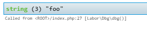
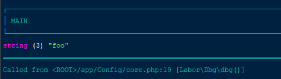
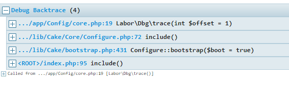
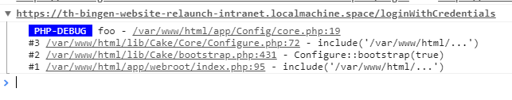

# DBG - Debug Helpers
This library is basically just a wrapper around [Kint](https://github.com/kint-php/kint) and [PHP-Console](https://github.com/barbushin/php-console) combining them both into a powerful debugging tool.

## Installation
Install this package using composer:

```
composer require neunerlei/dbg
```

## Environment detection
It is not recommended to use this library in production. However if you have considered the risks and know what to do, this library tries to help you running it in production as securely as possible.

To do so there are different mechanics you may use to to determine when you want to enable the debugger or not.
First of all, to enable the environment detection set the "environmentDetection" to true

1. You can completely disable the functionality of this library by setting the "enabled" config option (see the "Configuration" section for further information) to false.
2. You may define a environment variable to determine if the debugging is enabled or not. By default the script will look for a env variable called "PROJECT_ENV" which requires a value of "dev" to enable the debugging. You may configure the name of the variable, as well as the expected value.
3. By default CLI commands are considered "save" and will allow execution of the debug methods. (See "cliIsDev" option)
4. It is possible to only enable the debugging when a specific referrer is transmitted by your browser. To enable this take a look at the "debugReferrer" option. (See the [referrer control](https://chrome.google.com/webstore/detail/referer-control/hnkcfpcejkafcihlgbojoidoihckciin?hl=en) extension for chrome.)

**IP's** I explicitly left out ip's for determining if the debugger should run or not, as I figure that method as quite error prone (especially when you work with a dynamic IP address). If you want to use this, you have to code that feature for yourself.

## Configuration
It is possible to define multiple options for the debugger. The configuration is performed using the dbgConfig() function.
Possible config options are: 

- enabled: (bool) default: TRUE | Master switch to enable/disable the debugging functionality. If you set this to false, none of the functions will do or output anything.
- environmentDetection: (bool) default: FALSE | Enables the environment detection mechanism if set to true.
	- envVarKey: (string) default: PROJECT_ENV | Determines the name of the environment variable to look for when enabling the debug feature.
	- envVarValue: (string) default: dev | Used in combination with "envVarKey" and determines which value to expect from the configured environment variable to enable the debugger.
	- cliIsDev: (bool) default: TRUE | Determines if the debugger should always output stuff in a CLI environment or not.
	- debugReferrer: (string|NULL) default: NULL | If set this will be expected as the referrer to enable the debugger capabilities.
- preHooks: (callable|array) | One or multiple callbacks to run in front of each debugger function (dbg,dbge,trace,tracee,...). Useful for extending the functionality. Each callback will receive $hookType, $callingFunction and $givenArguments as arguments.
- postHooks: (callable|array) | Same as "preHooks" but run after the debug output.
- consolePassword: (string|NULL) default: NULL | If set the phpConsole will require this value as password before printing the console output to the browser.
- logDir: (string|NULL) default: NULL | If set, the logFile() function will dump the logfile to the given director. Make sure it exists and is writable by the webserver!

## Functions 
### dbg()
Takes any number of arguments and prints them to the screen, either formatted for html or for cli, depending on the current context.

```php
dbg("foo");
```

Will render something like this in a browser:



and something like this in a CLI app:




### dbge()
Works exactly the same way as dbg() but kills the script exit(0) after dumping the arguments to the screen.


### trace()
Prints the current debug backtrace to the screen, either formatted for html or for cli, depending on the current context.

```php
trace();
```

Will render something like this in a browser:




### tracee()
Again, works exactly the same as trace, but kills the script after printing it.


### logConsole()
This function is mend specifically for in-browser development only. It relies on [PHP-Console](https://github.com/barbushin/php-console) and the [chrome php console extension](https://chrome.google.com/webstore/detail/php-console/nfhmhhlpfleoednkpnnnkolmclajemef) to render the given values to the javascript console without using html script tags or similar.
It works also when performing redirects or throwing exceptions, as the data will be transferred over a http header.
```php
logConsole("foo");
```

This will output something like:




### logFile()
Receives any number of arguments and will dump them into a plain log file. 
The logfile will be located (in order of priority):

- $_ENV["_DBG_LOG_DIR"]/dbg_debug_logfile.log if this environment variable contains a writable directory path
- dbgConfig("logDir") /dbg_debug_logfile.log if the environment variable is empty and the directory is writable
- /var/www/logs/dbg_debug_logfile.log if the logs directory is writable
- /$SYS_TEMP_DIR/labor_debug_logfile.log

```php
logFile("foo");
```

### isDbgEnabled()
This function returns true if the debug functions are currently operational (including the checks for the environment detection) and will return TRUE if so, or FALSE if not.

### dbgConfig(string $key = "", $value = NULL)
This function is used to configure the debugger with the options seen in the "Configuration" section.
If this function is called without arguments it will return the current list of config option. If it is called with a key
but without value it will return the current value for the given key. 

If you supply both key and value you will set the given config option.

```php
 // Enable environment detection
 dbgConfig("environmentDetection", TRUE);
 ```

## Postcardware
You're free to use this package, but if it makes it to your production environment I highly appreciate you sending me a postcard from your hometown, mentioning which of our package(s) you are using.

You can find my address [here](https://www.neunerlei.eu/). 

Thank you :D 
